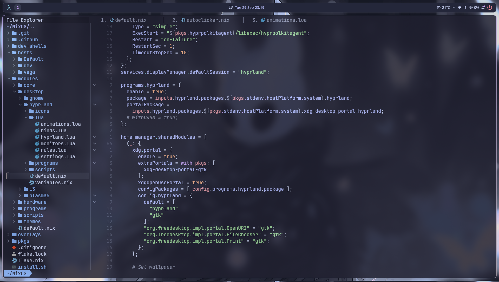

# Nixvim Configuration

A modern, feature-rich Neovim configuration built with [Nixvim](https://github.com/nix-community/nixvim) - a Nix-based Neovim configuration framework.



## Quick Start

### Try it without installing
```bash
nix run github:sijanthapa171/nixvim
```

### Install on NixOS

#### 1. Add to your `flake.nix`
```nix
{
  inputs = {
    nixpkgs.url = "github:nixos/nixpkgs/nixos-unstable";
    nixvim.url = "github:sijanthapa171/nixvim";
  };
}
```

#### 2. Add to your Home Manager configuration
```nix
{ inputs, pkgs, system, ... }:
{
  home.packages = [
    inputs.nixvim.packages.${system}.default
  ];
}
```

#### 3. Rebuild your system
```bash
nixos-rebuild switch --flake .#your-hostname
# or for home-manager
home-manager switch --flake .#your-user
``